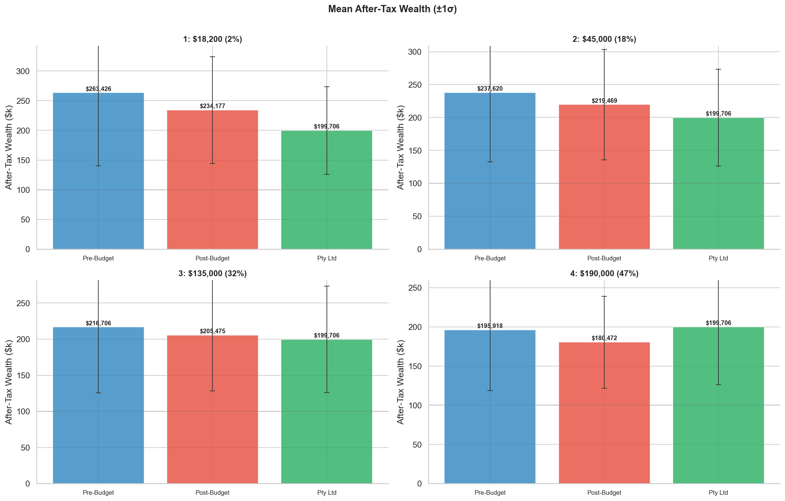
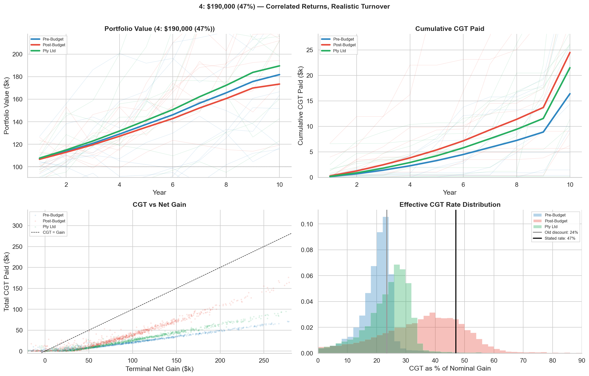
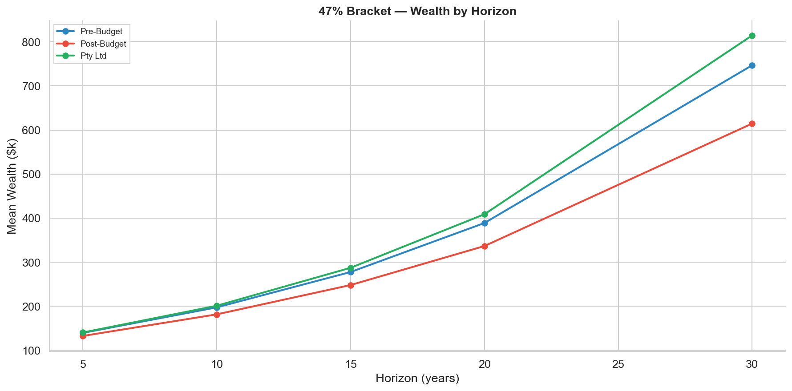

After the 2026-27 Budget's changes removing the 50% CGT discount and cross-asset loss offsetting (now legislated, effective July 2027), we test the impact across tax brackets and entity structures.

## Static Assumptions

- 6% capital gain p.a., 3% dividend yield p.a. (9% total return, rounded from VAS 10yr: 5.2% CG, 4.16% yield)
- 10 years (sensitivity: 5/10/15/20/30 years)
- 2.5% CPI p.a. (for inflation-indexed cost base)
- Stock-level annual volatility: lognormal distribution, median 22% (clipped 8-60%)
- Pairwise correlation: single-factor model, rho = 0.35
- Portfolio: 20 equally-weighted stocks ($5,000 each on a $100,000 portfolio)
- Annual turnover: beta(2,6) distribution (mean 25%), capped at 50% of stocks; full liquidation at year 10
- Monte Carlo: 10,000 simulation runs (1,000 for sensitivity sweeps)
- Capital gains and dividends are reinvested; returns are lognormal
- **Dividend franking.** 80% of dividends are fully franked. For individuals: tax = `(mr - 0.30) / 0.70` on franked dividends, with excess refunded if mr < 30%. For Pty Ltd: no tax on franked dividends (franking credits accumulate).
- **Post-Budget CGT floor: 32%** (30% statutory + 2% Medicare levy). Minimum rate on real gains applies to all brackets.
- **Pty Ltd: 30% corporate accumulation + multi-year retirement distribution.** Profits drawn down over multiple years, keeping total taxable income under $135k. Effective individual rate: 32% (30% bracket + 2% Medicare). Franking credits offset most of this, leaving a ~2% net top-up.

Source for budget changes: [Budget 2026-27: Tax Reform](https://budget.gov.au/content/04-tax-reform.htm)

## Archetypes

The 4 archetypes are based on the current resident tax rates 2025-26 from the [ATO](https://www.ato.gov.au/tax-rates-and-codes/tax-rates-australian-residents). Effective rates include the 2% Medicare levy.

| Taxable income      | Tax on this income                         | Effective rate |
| ------------------- | ------------------------------------------ | -------------- |
| $0 - $18,200        | Nil                                        | 2%             |
| $18,201 - $45,000   | 16c for each $1 over $18,200               | 18%            |
| $45,001 - $135,000  | $4,288 plus 30c for each $1 over $45,000   | 32%            |
| $135,001 - $190,000 | $31,288 plus 37c for each $1 over $135,000 | 39%            |
| $190,001 and over   | $51,638 plus 45c for each $1 over $190,000 | 47%            |

To capture each bracket, we place archetypes at the top of the income bracket.

- 1: 18,200 at 2%
- 2: 45,000 at 18%
- 3: 135,000 at 32%
- 4: 190,000 at 47%

## Scenarios

### 1: Pre-Budget (Individual)

- CGT: 50% discount, taxed at marginal rate
- Dividends: franked treatment (top-up at `(mr - 0.30)/0.70`; refund if mr < 30%)
- Cross-asset loss offsetting (gains and losses netted before CGT)

### 2: Post-Budget (Individual)

- CGT: cost base indexed to CPI, real gain taxed at max(marginal_rate, 32%)
- Dividends: franked treatment (as above)
- Nominal capital losses offset CPI-adjusted gains across assets. Cost bases are not indexed for determining losses — losses are recognised at their nominal value. Stocks with nominal gains below CPI generate no taxable gain and no loss to carry forward.
- Source: [Bills Digest No. 67, 2025-26](https://www.aph.gov.au/Parliamentary_Business/Bills_Legislation/bd/bd2526/26bd067)

### 3: Pty Ltd

- Corporate tax: 30% on realised nominal capital gains and unfranked dividends
- Franked dividends: 0% effective corporate tax (franking credits offset). Credits received accumulate in the franking account.
- Cross-asset loss offsetting within the company (all nominal losses offset nominal gains)
- **At retirement: multi-year distribution.** Profits drawn down over multiple years, keeping total taxable income under $135k. Effective individual rate: 32% (30% bracket + 2% Medicare). Franking credits offset most of this, leaving a ~2% net top-up (0.32 - 0.30).

## Modelling Approach

Monte Carlo simulation with annual turnover and correlated returns.

1. Generate 10,000 random 20-stock portfolios:
   - Per-stock volatility: lognormal distribution (median 22%, clipped 8-60%)
   - Pairwise correlation: single-factor model, rho = 0.35
   - Returns: lognormal, mean nominal capital gain 6% p.a.
2. Each year: apply price returns and dividends, randomly sell 0-50% of stocks (beta(2,6) turnover distribution, mean 25%)
3. Realize CGT on sold stocks per scenario rules; stocks underperforming CPI are stranded
4. Reinvest after-tax proceeds, reset cost bases (with CPI cost-year tracking per position)
5. Year 10: liquidate all remaining positions
6. Pty Ltd: accumulate at 30% corporate rate, then distribute at 32% effective rate with franking settlement

## Results (10 Years, $100k Initial, 10,000 Sims)

| Archetype | Pre-Budget | Post-Budget | Pty Ltd |
| --------- | ---------- | ----------- | ------- |
| 1: 2%     | $263,426   | $232,226    | $199,706 |
| 2: 18%    | $237,620   | $217,599    | $199,706 |
| 3: 32%    | $216,706   | $205,475    | $199,706 |
| 4: 47%    | $195,918   | $180,472    | $199,706 |

### Key Findings

- **Pre-Budget wins at lower brackets.** The 50% CGT discount at 2-18% creates near-zero effective CGT rates. Combined with franking refunds on dividends, Pre-Budget dominates at brackets below the corporate rate.
- **Pty Ltd wins at 47% ($199,706 vs $195,918).** The 30% corporate CGT rate with full loss offsetting and 0% tax on franked dividends overcomes Pre-Budget's 50% discount when the individual's marginal rate is high. Gap at 47%: Pty +$3.8k (1.9%).
- **Post-Budget is worst at every bracket.** The 32% CGT floor (30% + Medicare), CPI-indexed gains with quarantined real losses, and intertemporal loss-carry rebound effects make Post-Budget the least favourable structure at all income levels.
- **Pty Ltd is largely bracket-agnostic.** The 30% corporate rate applies regardless of the shareholder's bracket. The distribution top-up at 32% adds ~2% above the corporate rate. Result: $199,706 for all brackets. Your tax rate does not rise with income.

## 30-Year Comparison

At longer horizons, the compounding advantage of the 30% corporate rate becomes decisive.

| Archetype | Pre-Budget | Post-Budget | Pty Ltd |
| --------- | ---------- | ----------- | ------- |
| 1: 2%     | $1,751,380 | $1,274,676  | $814,534 |
| 2: 18%    | $1,302,159 | $1,047,921  | $814,534 |
| 3: 32%    | $998,835   | $881,663    | $814,534 |
| 4: 47%    | $746,799   | $614,514    | $814,534 |

At 30 years, Pty Ltd dominates the 47% bracket ($814,534 vs Pre-Budget $746,799) and is competitive at 32%. Pre-Budget still dominates lower brackets.

## Sensitivity: Time Horizon

Ranking stability across 5, 10, 15, 20, and 30-year horizons. At 47%, Pty Ltd overtakes Pre-Budget around year 10 and the gap grows to ~9% by year 30. Pty Ltd's advantage over Post-Budget is immediate and widens from ~5% (5yr) to ~32% (30yr). Full table and chart in notebook Section 5.

## Conclusion

The 2026-27 Budget's CGT reforms create a clear hierarchy. For investors in the 47% bracket, a Pty Ltd structure with multi-year retirement distribution is the optimal strategy. The combination of 30% corporate CGT with full cross-asset loss offsetting, 0% effective tax on franked dividends during accumulation, and a managed retirement drawdown at 32% effective rate produces the highest terminal wealth at both 10 and 30 years.

For lower brackets, the individual Pre-Budget structure remains dominant because the 50% CGT discount is dramatically more valuable than the corporate rate advantage. The Post-Budget individual scenario is the worst option at every bracket and every horizon. Its 32% CGT floor, CPI-indexed tax base with quarantined real losses, and intertemporal loss-carry rebound effects create a compounding tax penalty that grows with time.

The key insight is that the corporate structure is not universally superior: it depends on the investor's marginal rate. At the top bracket, the company wins. At lower brackets, the individual keeps it simple. No one should invest under the new Post-Budget rules as an individual if they have a choice.

## Footnotes

- **Multi-year distribution assumption.** Pty Ltd profits are assumed to be drawn down over multiple retirement years, keeping total taxable income under $135k. This produces an effective individual rate of 32% (30% bracket + 2% Medicare). A lump-sum distribution at the full working-year marginal rate would produce worse results.
- **VAS returns.** Capital gain and dividend yield are rounded from Vanguard Australian Shares Index (VAS) 10-year performance to mid-2026: 9.36% total return (5.20% CG + 4.16% yield). We use 9% total (6% CG + 3% yield) as a conservative round.
- **Bills Digest on loss offsetting.** Cost bases are indexed for gains but not for losses. Nominal losses offset CPI-adjusted gains across assets. Stocks below CPI generate no gain and no loss. Source: [Bills Digest No. 67, 2025-26](https://www.aph.gov.au/Parliamentary_Business/Bills_Legislation/bd/bd2526/26bd067).
- **Fixed marginal rates during accumulation.** The model uses constant rates during the 10-year accumulation phase. In reality, dividends and realised gains push investors into higher brackets, increasing the Post-Budget penalty for mid-bracket investors.
